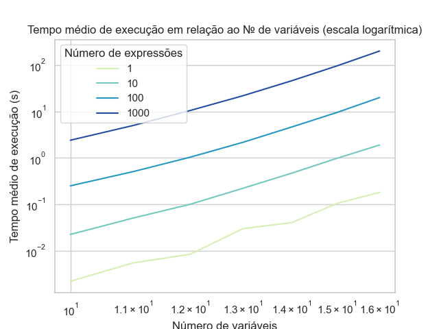
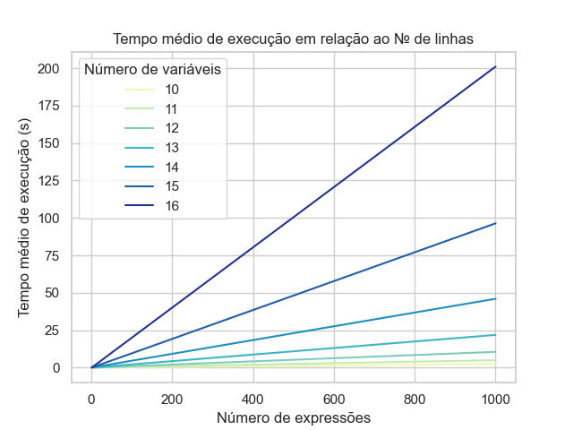

# Logic Prober

Pesquisar e desenvolver analisadores lexical, sintático e semântico para expressões lógicas e integrá-los entre si e com um otimizador.

> *Detalhes de implementação descritos nos comentários do código*

### Done

- Reestruturação do Analisador Lexical
- Reestruturação do Analisador Sintático
- Desenvolvimento do Analisador Semântico
- Integração dos analisadores com o otimizador (Mapa de Karnaugh)

# Integração e Otimização de um Analisador de Expressões da Lógica Proposicional

###### Guilherme Poleto, Gustavo Henrique Paetzold

### Resumo

A lógica proposicional descreve comportamentos lógicos pelas regras da álgebra booleana, analisar, simular e otimizar sentenças lógicas significa poder simular essas operações a nível lógico para os circuitos que implementam o comportamento lógico dessas expressões.
Nesse trabalho foram implementados e integrados analisadores léxico, sintático e semântico bem como um otimizador de expressões lógicas num programa de interface de linha de comando, foi também analisada a complexidade de tempo do método de análise semântica das expressões baseada em seu tempo médio de execução em relação a entradas controladas geradas de forma procedural.
Obteve-se como resultado um programa capaz de receber expressões como entrada que são analisadas e otimizadas, além de um relatório de erros (se houverem) e a tabela verdade da expressão. Concluiu-se também que a complexidade de tempo do algoritmo de análise semântica implementado baseado em árvore sintática abstrata é _O(2^n)_ sendo n o número de variáveis da expressão a ser analisada.

## Introdução

Lógica proposicional é uma forma de descrever comportamentos lógicos obedecendo à álgebra booleana e está presente nos dias de hoje em quase todo aparelho eletrônico, ser capaz de analisar, simular e otimizar sentenças lógicas significa ser capaz de realizar esses mesmos processos nos circuitos digitais que implementam a lógica da expressão. 
Para o desenvolvimento desses processos foram implementadas as estruturas de máquina de estados, pilha, fila, e árvore sintática abstrata, além de uma interface de linha de comando para a análise de expressões na linguagem de programação Python.
Para a análise da complexidade de tempo foram escritos scripts Python para geração de casos de teste e monitoramento do tempo de execução em múltiplos experimentos, além de scripts para plotagem de gráficos e computação de correlações com funções assintóticas.

## Materiais e Métodos

A álgebra booleana é um sistema algébrico que busca descrever problemas lógicos a partir de dois possíveis valores: verdadeiro ou falso, e três operações fundamentais, duas binárias (que operam com 2 valores): disjunção (_and_) e conjunção (_or_), e uma unária: negação (_not_), este conjunto de regras é a fundação da lógica proposicional, que é aplicada para definir o comportamento lógico de um conjunto de entradas.

Uma expressão lógica é um conjunto de conectivos (operações) e literais (variáveis) que seja válido na álgebra booleana e que possua um valor verdade associado, uma expressão pode ser dividida em subconjuntos que respeitam a precedência de operações de seus conectivos, todos os subconjuntos possuem um valor verdade associado, o componente elementar de uma expressão lógica é o literal que não possui conectivos. Valor verdade é a valoração binária (verdadeiro ou falso) que uma expressão lógica apresenta, o conjunto de todos os valores verdade de uma expressão lógica é chamada tabela verdade.

| A | B | ~A | ~B | A ∧ B | A ∨ B |
|:-:|:-:|:-:|:-:|:-:|:-:|
| 0 | 0 | 1 | 1 | 0 | 0 |
| 0 | 1 | 1 | 0 | 0 | 1 |
| 1 | 0 | 0 | 1 | 0 | 1 |
| 1 | 1 | 0 | 0 | 1 | 1 |

#### Desenvolvimento e integração do analisador

Para a implementação do processo de análise de expressões lógicas, que consiste de três etapas, foi escrito um programa na linguagem de programação Python responsável por interfacear a entrada das proposições com o analisador, na análise léxica uma sequência de caracteres representando a expressão é consumida por uma máquina de estados que descreve as características léxicas da linguagem proposta para a representação das sentenças lógicas, para este fim, foi realizada a implementação da máquina de estados descrita em [LEXF: Um Analisador Lexical Eficiente e Multipropósito](https://eventos.utfpr.edu.br//sicite/sicite2020/paper/view/7353) que tem como resultado a _tokenização_ da expressão. O processo de tokenização trata de atribuir um identificador (_token_) a cada elemento da expressão que esteja de acordo com as regras léxicas, cada identificador representa um tipo de operando ou operação, nesta implementação o _lexicon_ (conjunto de _tokens_ possíveis) é: _PAR_ (parêntese), _NEG_ (negação), _BIN_ (valor binário), _VAR_ (variável), _DISJ_ (disjunção), _CONJ_ (conjunção), _COND_ (condicional), _BICON_ (bicondicional).

Na etapa seguinte é analisada a estrutura sintática da expressão, utilizando-se do algoritmo _shunting yard_ para a verificação da completude da expressão e de suas subdivisões e para converter a notação in-fixa (convencional) em notação polonesa reversa, de forma a respeitar precedência de operações da álgebra de _Boole_. _Shunting yard_ é um método criado por Edsger Dijkstra para a análise de expressões lógico-matemáticas em notação in-fixa que pode gerar uma cadeia de caracteres de notação pós-fixa (notação polonesa reversa), onde os operadores sucedem seus operandos e tem como vantagem o fato de não necessitar de parênteses para expressar a precedência de operações, facilitando a computação das operações atômicas, o algoritmo também é capaz de gerar uma árvore sintática abstrata, uma estrutura de árvore utilizada para representar a expressão dividindo-a em menores operações até que o nó represente uma variável ou valor binário, ao mesmo passo que geramos a notação pós-fixa verificamos se as operações entre os elementos são válidas, checando os _tokens_ de cada expressão, nesse momento seria possível a valoração da operação, unindo análise sintática e semântica no mesmo processo, no entanto, optou-se, por motivos didáticos, a separação explícita destes processos.

 Na última etapa da análise é realizada a valoração de cada um de seus literais numa implementação  recursiva de uma árvore sintática abstrata, construída de forma com que os nós folha representem os componentes elementares da expressão, cada nó intermediário represente a valoração dos conectivos e o nó raiz represente o valor verdade da expressão completa, a valoração ocorre de baixo para cima, ou seja, os primeiros nós a serem valorados são os nós folha, precedidos por seus conectivos de forma recursiva até a valoração do nó raiz. Essa implementação é obtida por meio de polimorfismo, todas as classes representam um _token_, que por sua vez, representa uma operação ou operando, todas as classes derivam de uma classe virtual Expression, que representa o maior nível de abstração desses elementos, de Expression derivam-se as classes Operand e Operation, de Operand, derivam-se as classes Binary e Variable, que por sua vez, carregam valores associados. De Operation derivam-se UnaryOperation e BinaryOperation, de Unary Operation deriva-se apenas Not, que carrega a função de negação na valoração da árvore, de BinaryOperation derivam-se as classes correspondentes a seus atributos lógicos: And, Or, Conditional e Biconditional. Como interface para essas classes, foi escrita a classe SemanticAnalysis, responsável por instanciar corretamente a estrutura da árvore de acordo com a entrada e facilitar a saída dos dados de modo compreensível, em forma de tabela.

Como resultado dessa análise obtêm-se os _tokens_ léxicos estruturados em notação polonesa reversa e por fim a tabela verdade da expressão completa, com a qual podemos verificar os termos de satisfabilidade da expressão. É possível também valorar a tabela verdade de qualquer expressão intermediária a partir da valoração da subárvore que a representa.

#### Interface de linha de comando

Como parte da integração dos analisadores, foi criado o programa principal _src/main.py_ que implementa uma interface de linha de comando, recebendo como entrada uma expressão a ser analisada, ou o caminho de um arquivo com uma expressão por linha, além de um argumento para a verbosidade da saída das análises, o programa realiza as análises e exibe mensagens de saída das etapas de análise.

#### Integração com minimizador de expressões lógicas

Para afirmar que duas expressões lógicas quaisquer são equivalentes é necessário que se observe o mesmo número de variáveis e a mesma tabela verdade associada a cada uma das expressões, otimização lógica é o processo de buscar uma expressão equivalente que minimize o número de operações intermediárias, para tanto foi integrado neste analisador o algoritmo de otimização de Quine-McCluskey descrito e implementado em [Software educacional para ensino de minimização de expressões lógicas](https://eventos.utfpr.edu.br//sicite/sicite2021/paper/view/7870), que conta com uma implementação de um algoritmo de programação dinâmica e outro algoritmo guloso para solução do problema. Quine-McCluskey baseia sua solução na análise de implicantes primos para representar a sentença na forma de soma de produtos, utilizando-se apenas das três operações básicas da álgebra booleana.

#### Análise de desempenho

Para a análise de desempenho foi escrito o _script_ Python _test_generator.py_, localizado na pasta _tests_ que gera strings válidas sintática e lexicograficamente na linguagem proposta para que sejam valoradas pela classe de análise semântica e para que o tempo de execução do programa seja registrado com entradas controladas. Neste procedimento de geração da cadeia de caracteres foram geradas letras de "a" até "p" para tokens de variável e uma escolha aleatória entre "/\\", "\\/", ">" e"=", de acordo com o lexicon, representando as operações, é importante ressaltar que parênteses foram excluídos dessas escolhas pois não representam uma operação em si, mas uma forma de explicitar a precedência a ser seguida. foram geradas entradas de 5 até 16 variáveis nomeadas e dispostas na expressão em ordem alfabética, cada expressão possui o número de variáveis - 1 operações e, em média, 50% das variáveis são negadas, para cada número de variáveis possível foram gerados 4 arquivos contendo de 1 até 1000 expressões com a razão de 10 vezes entre os arquivos.

Foi escrito também outro _script_ para a leitura e processamento e monitoramento do tempo de execução do analisador semântico nessas entradas, esse _script_ gera 10 amostras de tempo por arquivo e salva o tempo médio de execução em um arquivo _.csv_ contendo também o número de linhas e de variáveis dos respectivos experimentos.

## Resultados e Discussões

Após a geração de arquivos de teste e execução dos experimentos obtemos uma tabela no formato _.csv_ contendo o número de variáveis, o de linhas e o tempo médio de execução em segundos de cada experimento, a partir desses dados podemos realizar uma análise exploratória para a análise da complexidade de tempo desse algoritmo.

Podemos observar no gráfico acima que existe uma relação aproximadamente exponencial do número de variáveis com o tempo médio de execução, e abaixo vemos que de forma independente do número de expressões, todas seguem o mesmo comportamento de crescimento da função.

Podemos, portanto, assumir o conjunto de dados onde o número de expressões é de 1000 como o conjunto que representará a função de tempo do algoritmo e o chamaremos de _F(x)_, a partir dela podemos buscar uma função _f(x)_ que se aproxime da função de tempo do algoritmo e que apresente o mesmo comportamento de crescimento. Como mencionado anteriormente, observou-se que a função parece ter comportamento exponencial, portanto, podemos comparar a função _f(x)=2^x_ com a função de tempo do programa.

O gráfico acima explicita o mesmo comportamento de crescimento em abas as funções e o mapa de calor abaixo evidencia a correlação das mesmas. Ao calcular o coeficiente de correlação da função de tempo de execução com _f(x) = 2^x_ obtemos o valor médio de 0.9362848072499903.

A notação Big-O é uma notação matemática que descreve o comportamento limitante superior de uma função e pode ser descrito como uma função que se aproxime do limite superior da função a ser analisada. De acordo com a análise aqui apresentada, _f(x)=2^x_ pode ser assumida como função assintótica da função de tempo de execução por número de variáveis, podemos então afirmar que a complexidade de tempo dessa implementação pode ser aproximada pela função assintótica _O(N) = 2^N_.

De forma análoga, podemos analisar a função de tempo de execução por número de expressões de entrada. Observa-se uma relação linear entre as variáveis e mesmo comportamento de crescimento independente de número de variáveis.

Ao calcular o coeficiente de correlação da função do número de variáveis com _f(x) = x_ obtemos o valor médio de 0.9120112897941848.

Podemos portanto afirmar que complexidade de tempo dessa implementação pode ser aproximada pela função assintótica _O(N) = 2^N_ com _N_ sendo o número de variáveis e _O(M) = M_ com _M_ sendo o número de expressões de mesmo número de operações e de variáveis.

## Conclusão

Nesse trabalho foram integrados analisadores léxico, sintático e semântico e o algoritmo de otimização de expressões de Quine-McCluskey em uma interface de linha de comando, foi também realizada a análise assintótica da complexidade de tempo do analisador semântico implementado por meio de análise exploratória da função do tempo de execução do programa pelo tamanho de suas entradas, em que se concluiu que o programa tem complexidade descrita por _O(N) = 2^N_ em que _N_ é o número de variáveis e _O(M) = M_ em que _M_ é o número de expressões de mesmo número de operações e de variáveis.

## Agradecimentos

## Disponibilidade de código

O código-fonte está disponibilizado na plataforma online [GitHub](github.com/GPoleto27/logic-prober) sob licença _GNU General Public License v3.0_.

## Conflito de interesse
Não há conflito de interesse.

## Referências