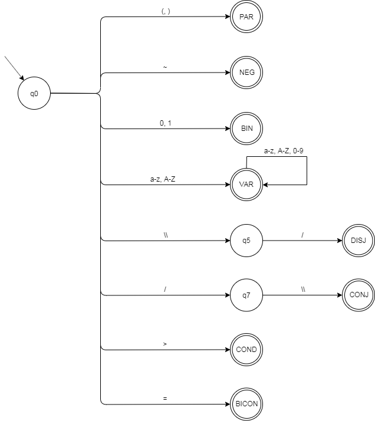
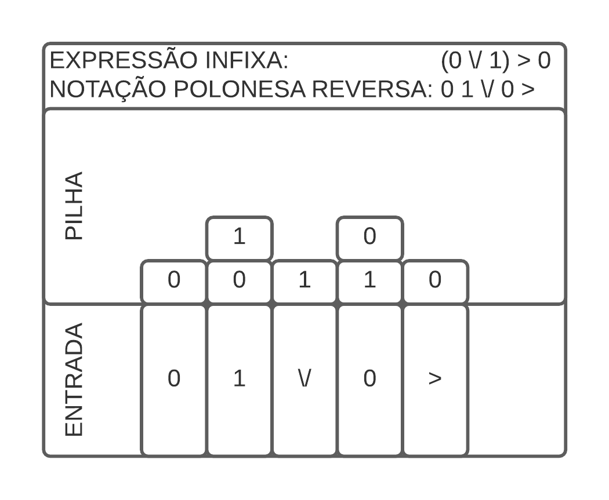
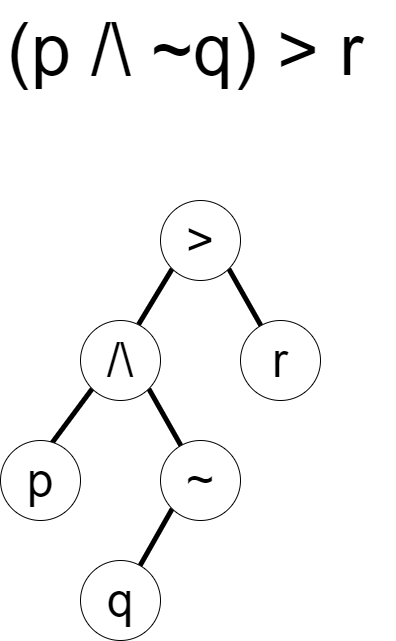

# Integração e Otimização de um Analisador de Expressões da Lógica Proposicional

###### Guilherme Poleto, Gustavo Henrique Paetzold

## Introdução

## Materiais e Métodos

A álgebra booleana é um sistema algébrico que busca descrever problemas lógicos a partir de dois possíveis valores: verdadeiro ou falso, e três operações fundamentais, duas binárias (que operam com 2 valores): disjunção (_and_) e conjunção (_or_), e uma unária: negação (_not_), este conjunto de regras é a fundação da lógica proposicional, que é aplicada para definir o comportamento lógico de um conjunto de entradas.

Uma expressão lógica é um conjunto de conectivos (operações) e literais (variáveis) que seja válido na álgebra booleana e que possua um valor-verdade associado, uma expressão pode ser dividida em subconjuntos que respeitam a precedência de operações de seus conectivos, todos os subconjuntos possuem um valor-verdade associado, o componente elementar de uma expressão lógica é o literal que não possui conectivos. Valor-verdade é a valoração binária (verdadeiro ou falso) que uma expressão lógica apresenta, o conjunto de todos os valores-verdade de uma expressão lógica é chamada tabela verdade.

| A | B | ~A | ~B | A ∧ B | A ∨ B |
|:-:|:-:|:-:|:-:|:-:|:-:|
| 0 | 0 | 1 | 1 | 0 | 0 |
| 0 | 1 | 1 | 0 | 0 | 1 |
| 1 | 0 | 0 | 1 | 0 | 1 |
| 1 | 1 | 0 | 0 | 1 | 1 |

#### Desenvolvimento e integração do analisador

Para a implementação do processo de análise de expressões lógicas, que consiste de três etapas, foi escrito um programa na linguagem de programação Python responsável por interfacear a entrada das proposições com o analisador, na analise léxica uma sequência de caracteres representando a expressão é consumida por uma máquina de estados que descreve as características léxicas da linguagem proposta para a representação das sentenças lógicas, para este fim, foi realizada a implementaçao máquina de estados descrita em [LEXF: Um Analisador Lexical Eficiente
e Multipropósito](https://eventos.utfpr.edu.br//sicite/sicite2020/paper/view/7353) que tem como resultado a _tokenização_ da expressão. O processo de tokenização trata de atribuir um identificador (_token_) a cada elemento da expressão que esteja de acordo com as regras léxicas, cada identificador representa um tipo de operando ou operações, nesta implementação o _lexicon_ (conjunto de _tokens_ possíveis) é: _PAR_ (parêntese), _NEG_ (negação), _BIN_ (valor binário), _VAR_ (variável), _DISJ_ (disjunção), _CONJ_ (conjunção), _COND_ (condicional), _BICON_ (bicondicional).

Na etapa seguinte é analisada a estrutura sintática da expressão, utilizando-se do algoritmo _shunting yard_ para a verificação da completude da expressão e de suas subdivisões e converter a notação in-fixa (convencional) em notação polonesa reversa de forma a respeitar precedência de operações da álgebra de _Boole_. _Shunting yard_ é um método criado por Edsger Dijkstra para a análise de expressões lógico-matemáticas em notação in-fixa que pode gerar uma cadeia de caracteres de notação pós-fixa (notação polonesa reversa), onde os operadores sucedem seus operandos e tem como vantagem o fato de não necessitar de parênteses para expressar a precedência de operações, facilitando a computação das operações atômicas, o algoritmo também é capaz de gerar uma árvore sintática abstrata, uma estrutura de árvore utilizada para representar a expressão dividindo-a em menores operações até que o nó represente uma variável ou valor binário, ao mesmo passo que geramos a notação pós-fixa verificamos se as operações entre os elementos são válidas, checando os tokens de cada sub-expressão, nesse momento seria possível a valoração da operação, unindo análise sintática e semântica no mesmo processo, no entanto, optou-se, por motivos didáticos, a separação explícita destes processos.

 Na última etapa da análise é realizada a valoração de cada um de seus literais numa implementação  recursiva de uma árvore sintática abstrata, construída de forma que os nós-folha representem os componentes elementares da expressão, cada nó intermediário represente a valoração dos conectivos e o nó raiz represente o valor-verdade da expressão completa, a valoração ocorre de baixo para cima, ou seja, os primeiros nós a serem valorados são os nós-folha, precedidos por seus conectivos de forma recursiva até a valoração do nó raiz.

Como resultado dessa análise obtem-se os _tokens_ léxicos estruturados em notação polonesa reversa e por fim a tabela verdade da expressão completa, com a qual podemos verificar os termos de satisfabilidade da expressão. É possível também valorar a tabela verdade de qualquer expressão intermediária a partir da valoração da sub-árvore que a representa.

#### Integração com minimizador de expressões lógicas

Para afirmar que duas expressões lógicas quaisquer são equivalentes é necessário que se observe o mesmo número de variáveis e a mesma tabela verdade associada a cada uma das expressões, otimização lógica é o processo de buscar uma expressão equivalente que minimize o número de operações intermediárias, para tanto foi integrado neste analisador o algoritmo de otimização de Quine-McCluskey descrito e implementado em [Software para minimização de expressões lógicas utilizando Mapas de Karnaugh](https://eventos.utfpr.edu.br//sicite/sicite2020/paper/view/6073), que conta com uma implementação de um algoritmo de programação dinâmica e outro algoritmo guloso para solução do problema. Quine-McCluskey baseia sua solução na análise de implicantes primos a partir de mapas de Karnaugh para representar a sentença na forma de soma de produtos, utilizando-se apenas das três operações básicas da álgebra booleana. Mapas de Karnaugh são diagramas utilizados para simplificação de expressões lógicas a partir da representação bidimensional da tabela verdade de uma expressão e agrupamento de valores-verdade.

## Resultados e Discussões

## Conclusão

## Agradecimentos

## Disponibilidade de código

O código-fonte está disponibilizado na plataforma online [GitHub](github.com/GPoleto27/logic-prober) sob licença _GNU General Public License v3.0_.

## Conflito de interesse
Não há conflito de interesse.

## Referências
